# Screenshots

This gallery documents the primary production workflow. Every image was captured from a local
production build with synthetic FRM-style material. No learner documents, API keys, or private
runtime data are included.

## Course Setup

### Course library

Create and open independent exam-prep workspaces.

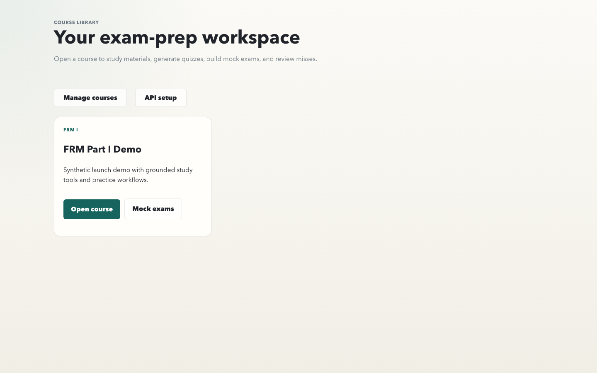

### Model setup

Configure separate practice-generator, Butler, and parser-agent model profiles.

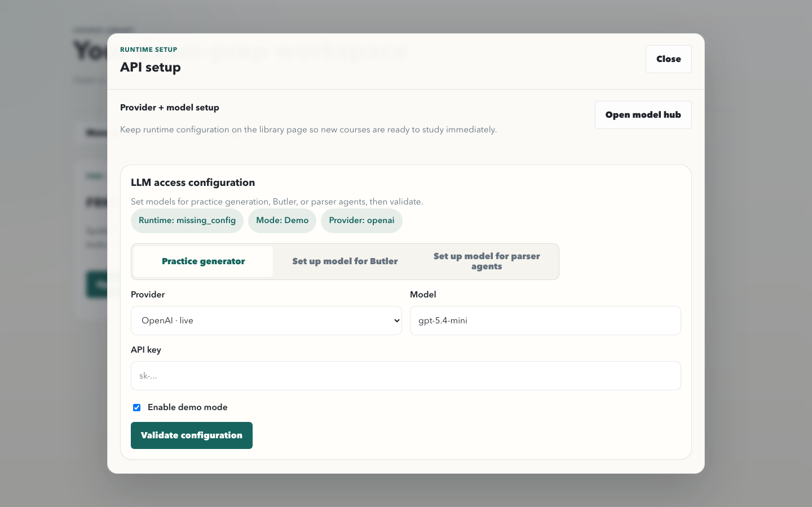

### Resume overview

Return directly to the last module, flashcard, or quiz attempt.

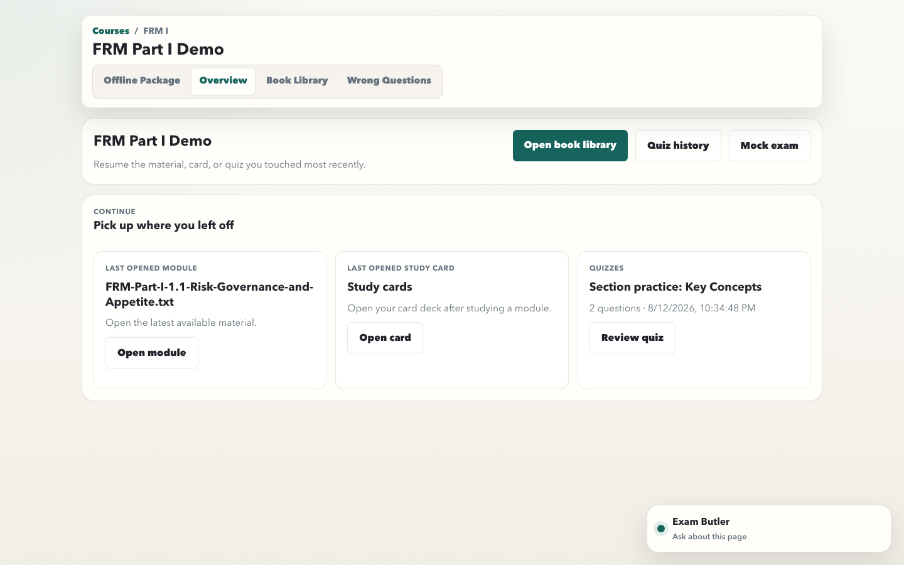

## Study Workflow

### Materials and upload

Upload books or notes and inspect processing readiness from one library.

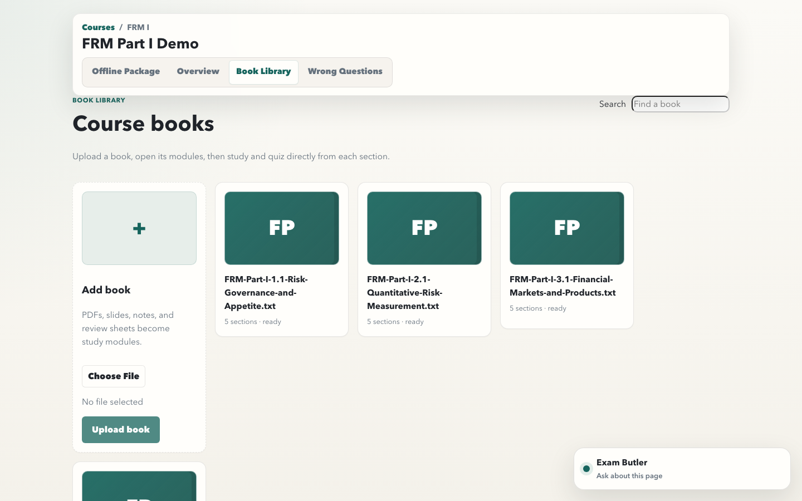

### Source study view

Trace a concept to its quoted source while keeping the full document available.

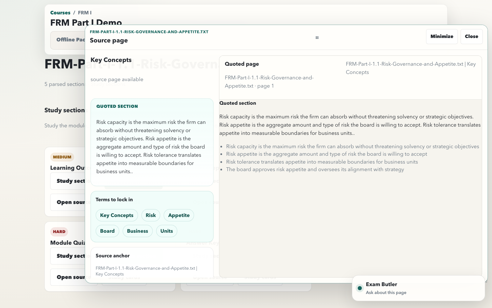

### Flashcard review

Review grounded cards with keyboard-friendly controls and large transparent navigation targets.

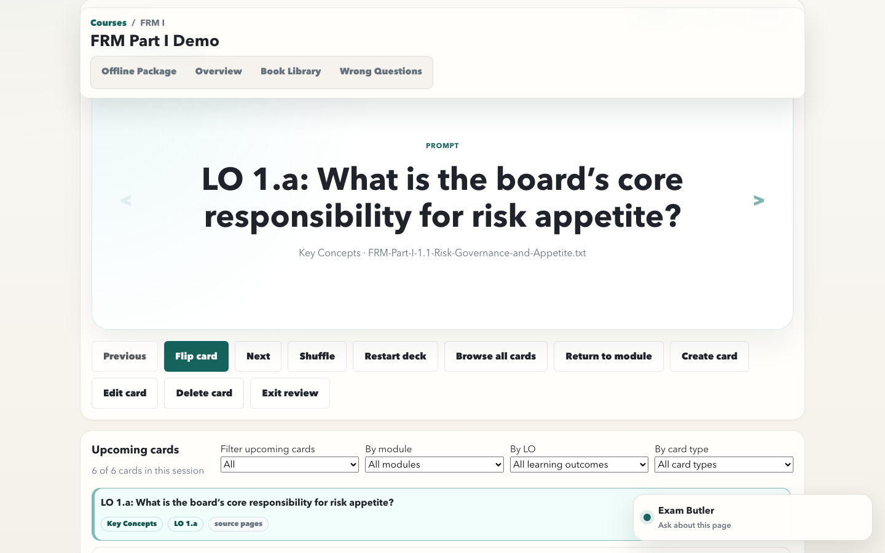

### Flashcard browser

Filter and jump across a large deck by learning objective, module, type, confidence, or source page.

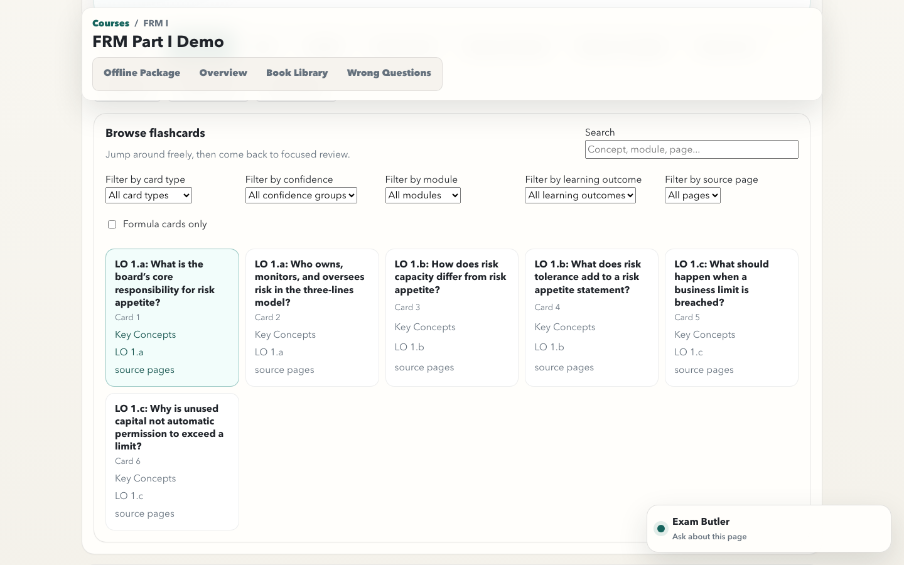

## Practice And Review

### Grounded quiz

Generate a section quiz, inspect its quality-gate status, answer it, and grade it in context.

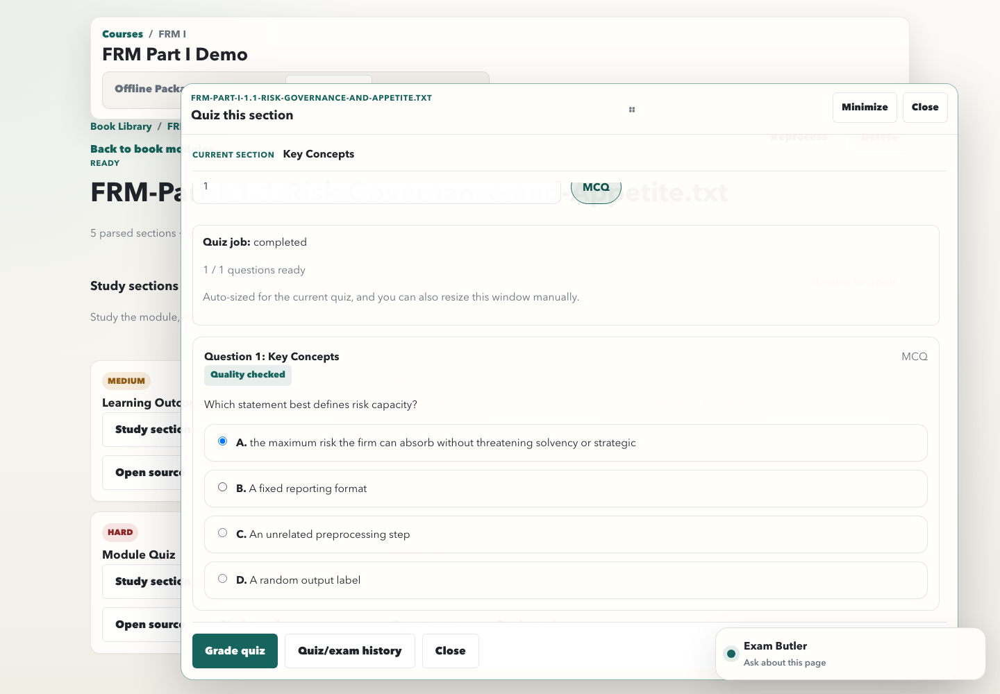

### Wrong questions and attempt history

Open saved quiz and mock-exam attempts from the review workspace.

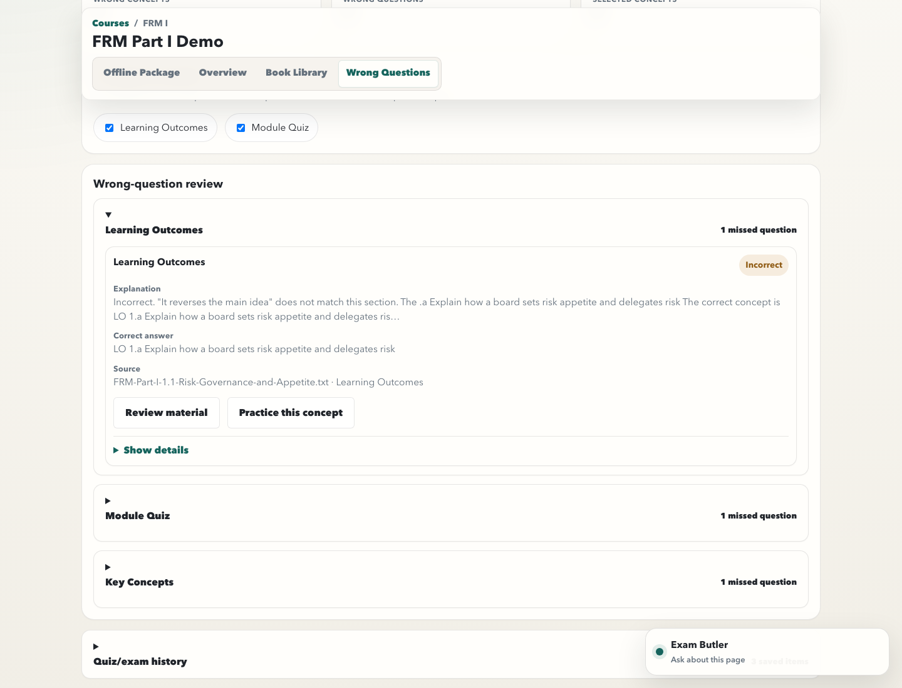

### Grounded answer review

Review the score, explanation, correct answer, and source for each submitted question.

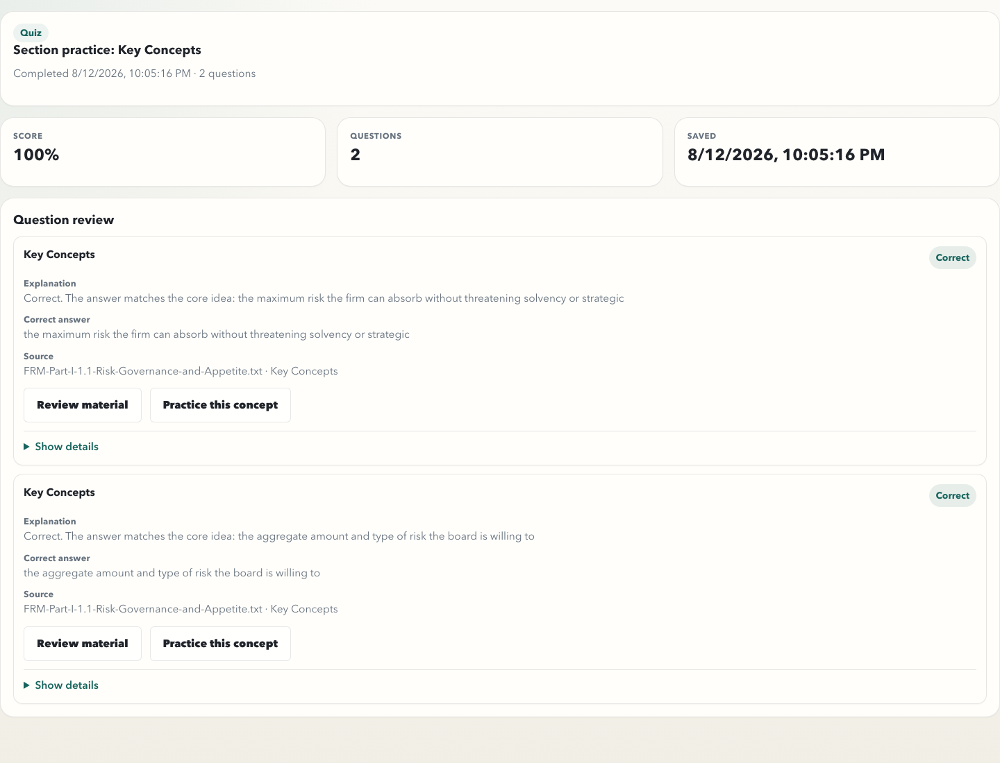

## Mock Exams And Offline Output

### Mock exam builder

Weight modules and map a generated exam one-for-one to a parsed source exam.

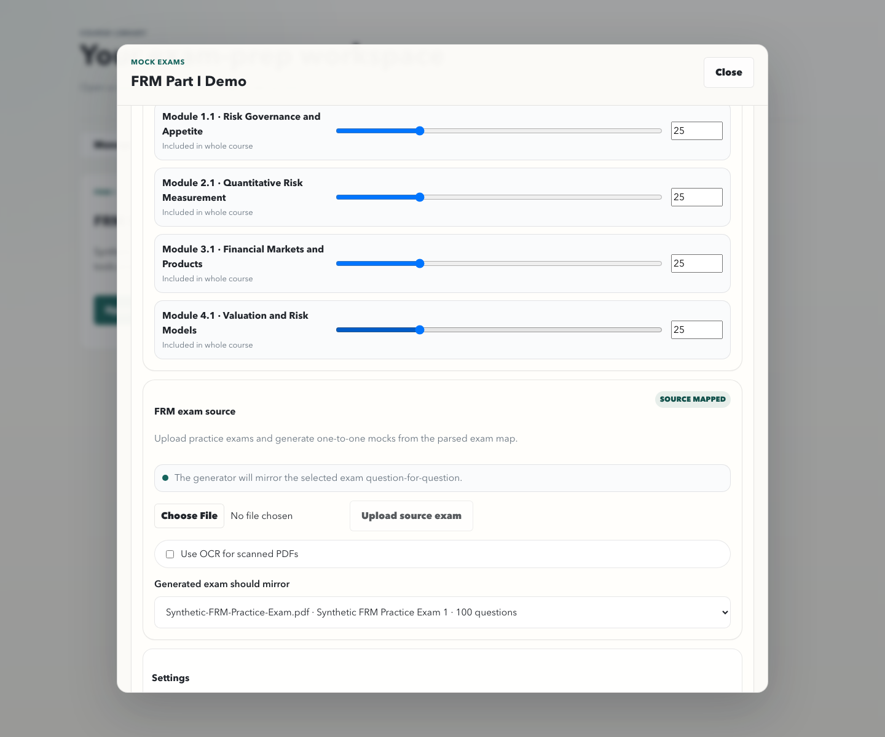

### Offline package producer

Select books and generate reusable interactive HTML study-card or mock-exam packages.

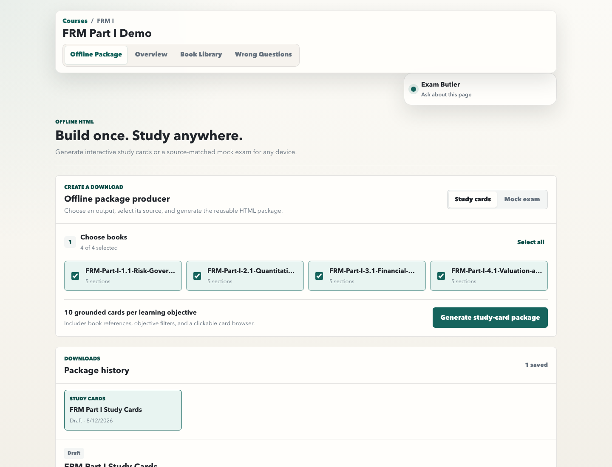

## Exam Butler

Open the lightweight teaching assistant without leaving the current study page.

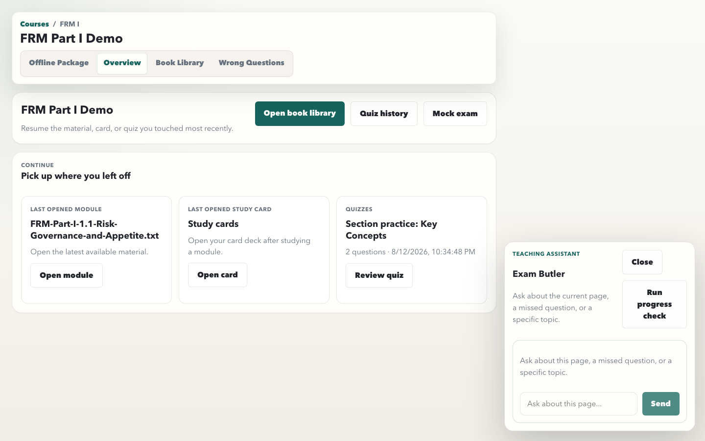
